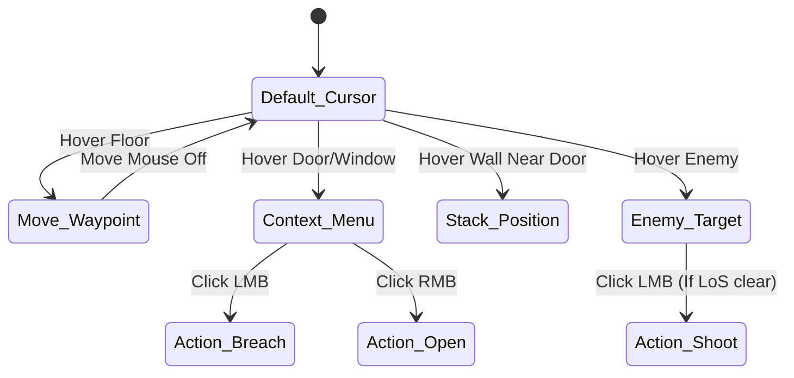

# TACTICAL BREACH: Control Reference v1

> **Project:** TACTICAL BREACH
> **Version:** 1.0 (Draft)
> **Status:** Pending Expansion
> **Path:** `docs/td_docs/player_interaction/control_reference_v1.md`

## 1. Overview
- **Model:** Direct and absolute command model.
- **Keys:**
  - **RMB:** Move.
  - **LMB (Door):** Context menu (Open Quietly vs. Kick).
  - **LMB (Wall):** Stack/Queue for breach.
  - **H:** Hold/Anchor sector.
  - **F:** Follow (Lead/Wingman dynamic).
- **Feedback:** Selected units have white outlines. Laser sights turn yellow if friendly fire is likely.

## 2. Input Edge Cases & Interruptions (Разрешение конфликтов)
- **`Follow [F]` vs `Hold [H]`:** Если оперативник А находится в режиме `Hold [H]`, передача ему команды `Follow` на оперативника Б **отменяет** `Hold` и заставляет его перейти в режим `Move`.
- **Interrupting Actions:** Если оперативник выполняет действие (например, взлом замка) и получает команду `Move [RMB]`, взлом немедленно прерывается (с потерей прогресса), и юнит начинает движение.
- **Queueing (Удержание Shift):** Позволяет задать цепочку команд. Если в цепочке происходит зрительный контакт с врагом (Alert), цепочка **приостанавливается** до команды игрока или до зачистки угрозы (в зависимости от RoE).

## 3. Cursor State Machine (Схема переходов)
Привязка контекстного курсора зависит от коллайдера под мышью.

